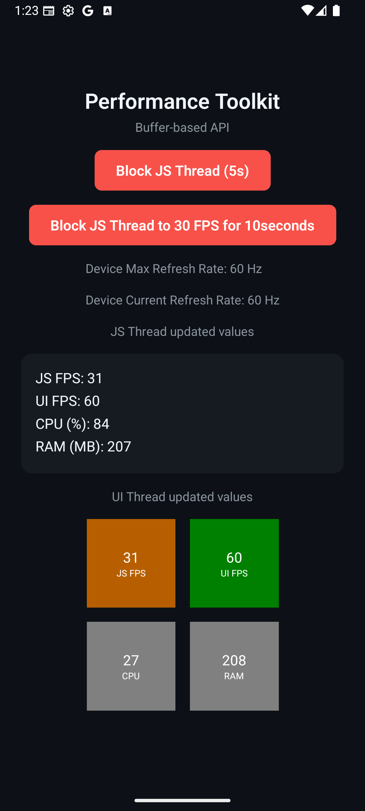

# React Native Performance Toolkit

Low overhead monitoring of important performance metrics for React Native apps like JS FPS, UI FPS, CPU usage, and memory usage.

<p align="center">
  
</p>

## Installation

```bash
bun add react-native-performance-toolkit react-native-nitro-modules
```

## Requirements

- React Native v0.76.0 or higher
- Reanimated v4 or higher

## Usage

### Very simple usage - get value once

```tsx
import {
  getJsFps,
  getUiFps,
  getCpuUsage,
  getMemoryUsage,
  getDeviceMaxRefreshRate,
  getDeviceCurrentRefreshRate,
} from 'react-native-performance-toolkit'

console.log('JS FPS:', getJsFps())
console.log('UI FPS:', getUiFps())
console.log('CPU Usage:', getCpuUsage())
console.log('Memory Usage:', getMemoryUsage())
console.log('Max Refresh Rate:', getDeviceMaxRefreshRate(), 'Hz')
console.log('Current Refresh Rate:', getDeviceCurrentRefreshRate(), 'Hz')
```

### Subscribe to changes

```tsx
import { onFpsJsChange } from 'react-native-performance-toolkit'

const unsubscribe = onFpsJsChange((fps) => {
  console.log('JS FPS changed:', fps)
})

// later
unsubscribe()
```

### React Hooks - JS Thread only

Please be aware that this hook will not update if your JS thread is blocked (0 FPS) because updates are happening only on that very same thread.

```tsx
import { useFpsJs } from 'react-native-performance-toolkit'

const SomeComponent = () => {
  const jsFps = useFpsJs()
  return <Text>JS FPS: {jsFps}</Text>
}
```

### Reanimated Hooks - UI Thread

To avoid the issue with not showing 0 FPS, it's recommended to use Reanimated based hooks or pre-made components. This will ensure the value is updated even if the JS thread is blocked.

```tsx
import { TextInput } from 'react-native'
import { useFpsJsSharedValue } from 'react-native-performance-toolkit'
import Animated, {
  useAnimatedReaction,
  useAnimatedRef,
  setNativeProps,
} from 'react-native-reanimated'

const AnimatedTextInput = Animated.createAnimatedComponent(TextInput)

const SomeComponent = () => {
  const inputRef = useAnimatedRef<TextInput>()
  const jsFps = useFpsJsSharedValue()

  useAnimatedReaction(
    () => jsFps.value.toString(),
    (value) => {
      setNativeProps(inputRef, { text: value })
    }
  )

  return <AnimatedTextInput ref={inputRef} />
}
```

### Pre-made Reanimated components - UI Thread

For better DX, the library provides pre-made Reanimated components that run solely on the UI thread. You can use either the convenience wrappers or the flexible base component:

```tsx
import {
  JSFpsCounter,
  UIFpsCounter,
  CpuUsageCounter,
  MemoryUsageCounter,
  UIThreadReanimatedCounter,
} from 'react-native-performance-toolkit'

const SomeComponent = () => {
  return (
    <>
      {/* Convenience components */}
      <JSFpsCounter />
      <UIFpsCounter />
      <CpuUsageCounter />
      <MemoryUsageCounter />

      {/* Or use the flexible base component with custom labels */}
      <UIThreadReanimatedCounter label="JS FPS" type="js" />
      <UIThreadReanimatedCounter label="UI FPS" type="ui" />
      <UIThreadReanimatedCounter label="CPU" type="cpu" />
      <UIThreadReanimatedCounter label="RAM" type="memory" />
    </>
  )
}
```

### Direct buffer access (advanced usage, experimental)

Some advanced usage might require direct buffer access. For example, you might want to use this library in a custom native component or you might want to use it in a worklet thread. This is experimental and might be changed in the future.

```tsx
import {
  getJsFpsBuffer,
  getUiFpsBuffer,
  getCpuUsageBuffer,
  getMemoryUsageBuffer,
} from 'react-native-performance-toolkit'

const jsFpsBuffer = getJsFpsBuffer()
const uiFpsBuffer = getUiFpsBuffer()
const cpuUsageBuffer = getCpuUsageBuffer()
const memoryUsageBuffer = getMemoryUsageBuffer()

const getValueFromBuffer = (buffer: ArrayBuffer) => {
  const view = new DataView(buffer)
  return view.getInt32(0, true) // true = littleEndian
}

console.log('JS FPS:', getValueFromBuffer(jsFpsBuffer))
console.log('UI FPS:', getValueFromBuffer(uiFpsBuffer))
console.log('CPU Usage:', getValueFromBuffer(cpuUsageBuffer))
console.log('Memory Usage:', getValueFromBuffer(memoryUsageBuffer))
```

### Access from worklets (advanced usage)

You can also access the value from any worklet thread, but to do that you need to use [Nitro Modules unboxing function](https://nitro.margelo.com/docs/worklets). For more detailed implementation look for [source code of UI Reanimated hooks like `useFpsJsSharedValue`](https://github.com/Nodonisko/react-native-performance-toolkit/blob/main/src/hooks/uiThreadHooks.ts).

```tsx
import { useCallback } from 'react'
import {
  BoxedJsFpsTracking,
  BoxedPerformanceToolkit,
} from 'react-native-performance-toolkit'

// ...

const updateFps = useCallback(() => {
  'worklet'
  const unboxedJsFps = BoxedJsFpsTracking.unbox()
  const unboxedPerformanceToolkit = BoxedPerformanceToolkit.unbox()

  let buffer = unboxedJsFps.getJsFpsBuffer()

  const view = new DataView(buffer)
  const value = view.getInt32(0, true)

  console.log('JS FPS:', value)

  // update shared value for example
  fpsValue.value = value
}, [])
```

## API Reference

- **Simple getters**
  - `getJsFps(): number` - Returns current JS FPS (0-60)
  - `getUiFps(): number` - Returns current UI FPS (0-30/60/90/120/...)
  - `getCpuUsage(): number` - Returns CPU usage percentage in Linux format
  - `getMemoryUsage(): number` - Returns memory usage in bytes
  - `getDeviceMaxRefreshRate(): number` - Returns device's maximum supported refresh rate (e.g., 120 Hz on ProMotion devices)
  - `getDeviceCurrentRefreshRate(): number` - Returns device's current active refresh rate (may be lower than max on adaptive refresh rate displays)

- **Subscription functions**
  - `onFpsJsChange(callback: (fps: number) => void): () => void` - Subscribe to JS FPS changes
  - `onFpsUiChange(callback: (fps: number) => void): () => void` - Subscribe to UI FPS changes
  - `onCpuChange(callback: (value: number) => void): () => void` - Subscribe to CPU usage changes
  - `onMemoryChange(callback: (value: number) => void): () => void` - Subscribe to memory usage changes

- **React Hooks (JS Thread)**
  - `useFpsJs(): number` - Hook that returns current JS FPS
  - `useFpsUi(): number` - Hook that returns current UI FPS
  - `useCpuUsage(): number` - Hook that returns current CPU usage
  - `useMemoryUsage(): number` - Hook that returns current memory usage

- **React Components (runs on UI Thread)**
  - `<JSFpsCounter />` - Pre-made component displaying JS FPS
  - `<UIFpsCounter />` - Pre-made component displaying UI FPS
  - `<CpuUsageCounter />` - Pre-made component displaying CPU usage
  - `<MemoryUsageCounter />` - Pre-made component displaying memory usage

- **Buffer-based API**
  - `getJsFpsBuffer(): ArrayBuffer` - Returns ArrayBuffer with JS FPS data
  - `getUiFpsBuffer(): ArrayBuffer` - Returns ArrayBuffer with UI FPS data
  - `getCpuUsageBuffer(): ArrayBuffer` - Returns ArrayBuffer with CPU usage data
  - `getMemoryUsageBuffer(): ArrayBuffer` - Returns ArrayBuffer with memory usage data

- **Advanced (Nitro Modules)**
  - `BoxedJsFpsTracking` - Direct boxed Nitro module instance for worklet usage
    - `getJsFpsBuffer(): ArrayBuffer`
  - `BoxedPerformanceToolkit` - Direct boxed Nitro module instance for worklet usage
    - `getUiFpsBuffer(): ArrayBuffer`
    - `getCpuUsageBuffer(): ArrayBuffer`
    - `getMemoryUsageBuffer(): ArrayBuffer`
    - `getDeviceMaxRefreshRate(): number`
    - `getDeviceCurrentRefreshRate(): number`

## Architecture

### Low overhead tracking

On Android, the library is reading values from virtual files like `/proc/stat` for CPU usage and `/proc/smaps_rollup` for memory usage. This is very low overhead and doesn't require any additional permissions.

On iOS, the library is reading values from `task_vm_info`/`rusage` direct kernel call. This is also extremely low overhead.

### Device Refresh Rate

The library provides two methods for getting refresh rate information:

- **Max Refresh Rate**: Returns the maximum supported refresh rate of the device
  - Android: Uses `Display.supportedModes` to find the highest available refresh rate
  - iOS: Uses `UIScreen.main.maximumFramesPerSecond`

- **Current Refresh Rate**: Returns the currently active refresh rate
  - Android: Uses `Display.getRefreshRate()` - useful for devices with adaptive refresh rate (e.g., 60/90/120Hz switching)
  - iOS: Uses `CADisplayLink.preferredFramesPerSecond` - useful for ProMotion displays that dynamically adjust

### JS FPS Tracking

You can build JS FPS tracking in plain JS using setTimeout or requestAnimationFrame. But this library is running similar logic in C++ on the same thread as JS, with lower overhead and a few other benefits. For example, we can easily access the value from other threads.

For now, the FPS baseline for JS FPS is always 60 FPS as it doesn't reflect real UI updates but more like "how busy the JS thread is". I am not 100% sure if this is the correct approach and might change it in the future and I am open to suggestions.

## Contributing

Pull requests are welcome. For major changes, please open an issue first to discuss what you would like to change.
